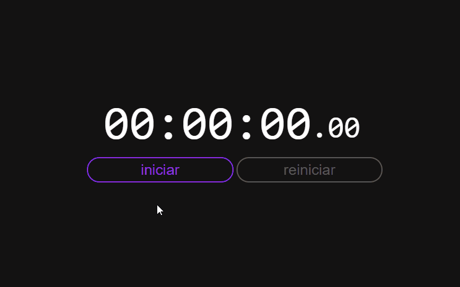

<h1 align="center">
    Crônometro JS
</h1>

<h1 align="center">
    
</h1>

<h2>🔖 Sobre</h2>
 Este projeto trata-se de um crônometro que desenvolvi com intuito de praticar JavaScript

---

<h2>🚀 Tecnologias utilizadas</h2>

<ul>
    <li>HTML5</li>
    <li>CSS3</li>
    <li>JavaScript</li>
</ul>

---

<h3 align="center">
    <a href="https://grazziotti.github.io/cronometro-js/">Acessar a demonstração</a>
</h3>